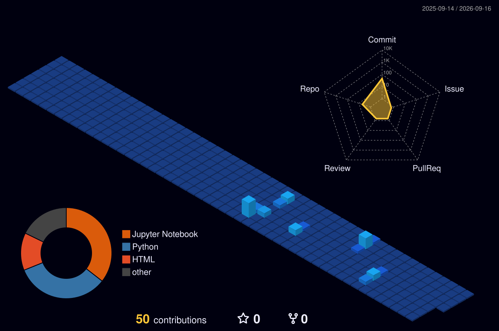

  

  
    

  
  

 

<table align="center" width="100%">
  <tr>
    <td width="60%" valign="top">
      <h2>🚀 About Me</h2>
      
I'm passionate about diving into complex, mind-bending problems—whether that's training deep learning models or figuring out the lore of <i>Dark</i> and <i>Severance</i>.

      <ul>
        <li>🎓 <b>Education:</b> B.Tech in Artificial Intelligence & Data Science at Bikaner Technical University.</li>
        <li>💻 <b>Experience:</b> Internships in <b>AI</b> and <b>Full-Stack Web Development</b>.</li>
        <li>🍷 <b>Current Focus:</b> Building a comprehensive AI/ML project focused on the French wine market.</li>
        <li>🌍 <b>Future Goals:</b> Cracking the IELTS, mastering DSA in Python, and becoming a successful Machine Learning Engineer.</li>
        <li>🗣️ <b>Languages:</b> Code (Python, JS) & Spoken (learning French & Italian!).</li>
        <li>⚡ <b>Off-Keyboard:</b> Grinding <i>Elden Ring</i> or <i>Kingdom Come: Deliverance II</i>, watching <i>One Piece</i>, or tuning into Indian Hip-Hop & reggaeton.</li>
      </ul>
    </td>
    <td width="40%" align="center" valign="top">
      <h2>📟 Live Console</h2>
       
      _Initializing+neural+network...;>_Epoch+1/100:+Loss:+0.42;>_Epoch+100/100:+Loss:+0.02;>_Model+converged.+Saving+weights...;kunal@macbook:~$+npm+run+build;>_Compiling+React+components...;>_Build+successful!;kunal@macbook:~$+python3+dsa_grind.py;>_Executing+LeetCode+Hard...+Done!" alt="Animated Terminal Console" />
    </td>
  </tr>
</table>

 

<h2 align="center">🛠️ Tech Stack & Arsenal</h2>

  
  
  
  
  
   
  
  
  
  
  
  
   
  
  
  
  
  

 

  <h3>My Neural Network Brain</h3>
  

 

  <h2>🌆 Isometric 3D Git City</h2>
  <picture>
    <source media="(prefers-color-scheme: dark)" srcset="profile-3d-contrib/profile-night-view.svg">
    <source media="(prefers-color-scheme: light)" srcset="profile-3d-contrib/profile-green-animate.svg">
    
  </picture>

 

  <h2>🐍 Contribution Graph Snake</h2>
  <picture>
    <source media="(prefers-color-scheme: dark)" srcset="https://raw.githubusercontent.com/kunal-garg-1/kunal-garg-1/output/github-contribution-grid-snake-dark.svg">
    <source media="(prefers-color-scheme: light)" srcset="https://raw.githubusercontent.com/kunal-garg-1/kunal-garg-1/output/github-contribution-grid-snake.svg">
    
  </picture>

